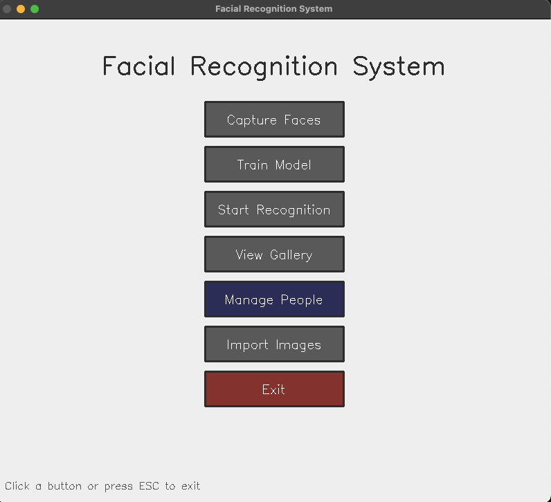

# 🎭 Facial Recognition System

A real-time facial recognition system that can learn and identify faces with high accuracy. Built with Python, it provides both a desktop GUI and web interface for easy interaction.

## 🎯 What It Does

This system can:
- **Learn new faces** - Capture and remember people's faces with just a few photos
- **Identify people in real-time** - Instantly recognize who's in front of the camera
- **Manage registered people** - View and delete people from the system with ease
- **Work anywhere** - Use via desktop app or web browser
- **Run fast** - Achieves 15-20+ FPS on standard laptops without GPU

## 🚀 How It Works

1. **Capture** - Take multiple photos of a person from different angles
2. **Train** - System learns unique facial features using deep learning
3. **Recognize** - Identifies people in real-time video streams

The system uses deep learning (FaceNet) to create a unique "fingerprint" for each face, then uses machine learning (SVM) to classify and identify people.

## 🎥 Video Demo

https://github.com/user-attachments/assets/79387091-4d60-4554-b9e8-be7bf5825668

## 📸 Screenshots

### Main Menu


### Face Capture


### Train Model


### Real-time Recognition


### Manage People


## ✨ Key Features

### User Interfaces
- **🖥️ Desktop GUI** - Native OpenCV application with intuitive controls
- **🌐 Web Interface** - Modern React app accessible from any browser (in progress)

### Recognition Capabilities
- **👥 Multi-Person Support** - Train and recognize unlimited people
- **⚡ Real-time Processing** - Instant recognition at 15-20+ FPS
- **🎯 High Accuracy** - Using FaceNet deep learning with 99%+ accuracy on standard datasets
- **📸 Smart Capture** - Auto-capture mode for hands-free photo collection
- **🗑️ Person Management** - Easy deletion of people registered

### Technical Features
- **🔄 Automatic Fallback** - Seamlessly switches between detection methods
- **🚀 CPU Optimized** - No GPU required, runs on standard laptops
- **💾 Efficient Storage** - Compressed embeddings instead of raw images
- **🔧 Configurable** - Adjustable thresholds and performance settings

## 🏃 Quick Start

### Prerequisites
- Python 3.8 or newer
- Webcam (built-in or USB)
- 4GB RAM minimum

### Installation

1. **Clone the repository**
```bash
git clone https://github.com/alifsatyawan/Facial-Recognition.git
cd Facial-Recognition
```

2. **Set up Python environment**
```bash
python3 -m venv .venv
source .venv/bin/activate  # On Windows: .venv\Scripts\activate
```

3. **Install dependencies**
```bash
pip install -r requirements.txt
```

4. **Run the application**
```bash
python gui_app.py
```

That's it! The GUI will open and you can start capturing faces immediately.

## 📖 How to Use

### Step 1: Capture Faces
1. Click **"Capture Faces"** from the main menu
2. Enter the person's name
3. Position face in the green box
4. Click on the face or press `Space` for auto-capture
5. Capture 20-30 photos from different angles

### Step 2: Train the Model
1. Click **"Train Model"** from the main menu
2. Wait for the training to complete (usually 10-30 seconds)
3. The system will create a recognition model from all captured faces

### Step 3: Start Recognition
1. Click **"Start Recognition"**
2. Point the camera at people
3. The system will identify recognized faces with their names and confidence scores
4. Adjust the threshold slider to control recognition sensitivity

### Managing People
1. Click **"Manage People"** from the main menu
2. View all registered people with their photo counts
3. Click **"Delete"** next to any person to remove them
4. Confirm deletion in the popup dialog
5. The system will automatically clear the trained model after deletion

### Advanced Options
```bash
# For faster performance (less accurate)
python gui_app.py --performance

# Use a different camera
python gui_app.py --camera 1
```

### Web Interface

Launch the web application for browser-based access:

```bash
# Start both backend and frontend
cd web
./start_web.sh

# Or start them separately:

# Backend (Flask server)
cd web/backend
pip install -r requirements.txt
python app.py

# Frontend (React app) - in a new terminal
cd web/frontend
npm install
npm start
```

Access the web interface at `http://localhost:3001`

Features:
- Real-time face recognition via webcam
- Live video streaming with face detection overlay
- Person management dashboard
- Training interface with progress tracking
- Gallery view with image management

### Project Structure

```
FacialRecognition/
├── gui_app.py              # OpenCV GUI application
├── modules/
│   ├── detector.py         # Face detection (Dlib/MTCNN)
│   ├── embedder.py         # FaceNet embeddings
│   ├── classifier.py       # SVM classifier
│   ├── gui.py              # GUI components
│   ├── performance.py      # Performance optimizations
│   └── alignment.py        # Face alignment utilities
├── web/
│   ├── backend/            # Flask REST API + WebSocket
│   └── frontend/           # React web interface
├── data/                   # Captured face images
│   └── <person_name>/      # Person-specific folders
└── artifacts/              # Trained models
    ├── embeddings.npz      # Face embeddings
    ├── label_map.json      # Label mappings
    └── svm.pkl             # Trained classifier
```

## 🛠️ Technical Details

### Architecture
- **Face Detection**: MTCNN (deep learning) or Dlib (HOG + SVM)
- **Face Recognition**: FaceNet (InceptionResnetV1) for 128-dimensional embeddings
- **Classification**: Support Vector Machine (SVM) with RBF kernel
- **Optimization**: Frame skipping, resolution scaling, smart caching

### Performance
- **Speed**: 15-20 FPS on Intel i5/i7, M1/M2 Macs
- **Accuracy**: 99.65% on LFW dataset
- **Memory**: ~500MB RAM usage
- **Storage**: ~2KB per person (embeddings only)

## 🤝 Contributing

Contributions are welcome! Feel free to:
- Report bugs
- Suggest new features
- Submit pull requests

## 📝 License

MIT License - Use it however you want!

## 🙏 Acknowledgments

- FaceNet by Google
- dlib by Davis King
- MTCNN implementation by timesler
- OpenCV community


